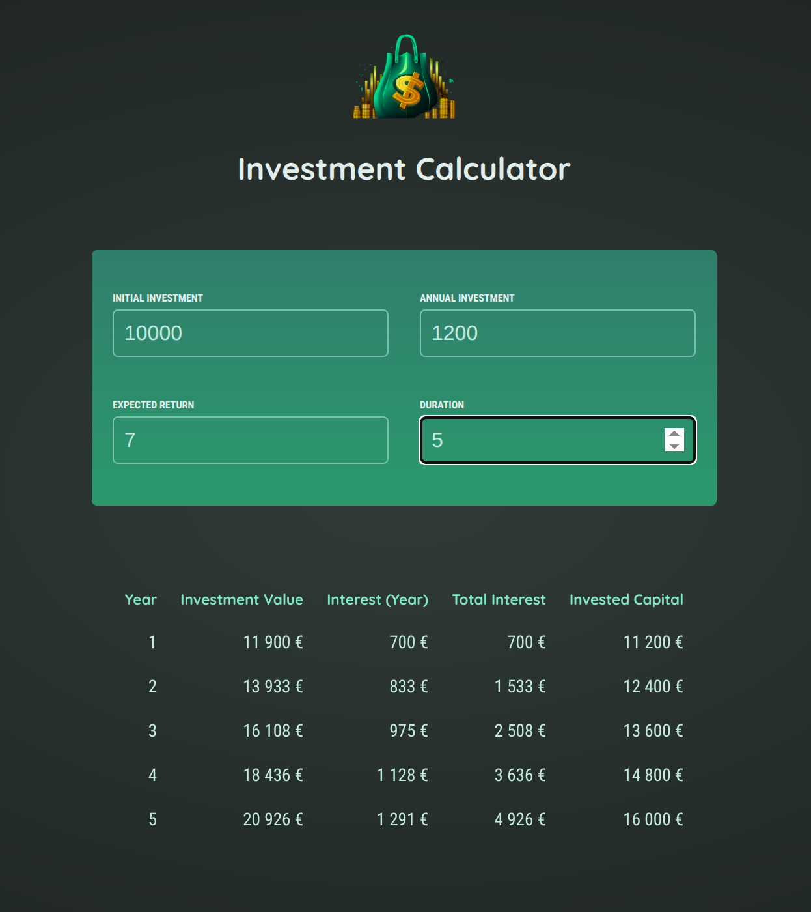

# Investment Calculator

This is an educational React app built while following the ["React – The Complete Guide"](https://www.packtpub.com/en-us/product/react-the-complete-guide-includes-hooks-react-router-and-redux-9781801812603) video course by Maximilian Schwarzmüller, published by Packt.

The app demonstrates fundamental React concepts and is intended for personal learning.

## Features

- Calculate investment returns over a specified duration
- Input customization for:
  - Initial investment amount
  - Annual investment contributions
  - Expected return rate
  - Investment duration
- Detailed yearly breakdown showing:
  - Investment value
  - Yearly interest
  - Total interest earned
  - Total invested capital
- Input validation for duration

## Screenshots

